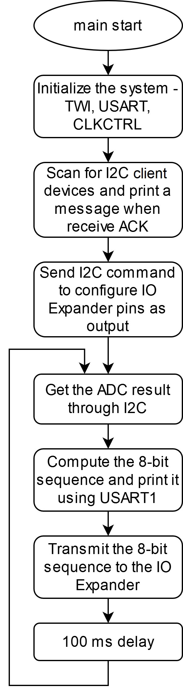

 <article class="markdown-body entry-content p-3 p-md-6" itemprop="This needs to locked down and 'never' changed">

# AVR128DA48 I2C Read Example

## Objective

This example demonstrates the basic functionality of the TWI peripheral with a basic I2C communication, both reading and writing from/to the slave devices. The device is connected to the PICkit Serial I2C Demo Board to communicate with the MCP3221 and MCP23008 I2C slave devices. The AVR128DA48 will first scan the I2C bus to discover all devices available on the bus. A message will be transmitted through USART to indicate the addresses of the devices that respond with the acknowledge signal. A voltage will be read by the MCP3221 (equipped with a 12-bit ADC) and the result will be transmitted through I2C to the AVR128DA48 device. Then, the MCU will transmit an 8-bit sequence to the MCP23008, equipped with an I/O Expander, to drive 8 LEDs on an LED bar. The LED display (consisting in 8 LEDs) will indicate the potentiometer voltage value (divided in subranges).
The software diagram of this application is presented in the figure below.
 

## Related Documentation

- [AVR128DA48 Product Family Page](https://www.microchip.com/design-centers/8-bit/avr-mcus/device-selection/avr-da)
- [AVR128DA48 Data Sheet](http://ww1.microchip.com/downloads/en/DeviceDoc/40002183A.pdf)

## Software Used

- MPLAB® X IDE 5.40 or newer [(microchip.com/mplab/mplab-x-ide)](http://www.microchip.com/mplab/mplab-x-ide)
- MPLAB® XC8 2.20 or newer compiler [(microchip.com/mplab/compilers)](http://www.microchip.com/mplab/compilers)
- AVR_Dx-DFP 1.4.75

## Hardware Used

- AVR128DA48 Curiosity Nano [(DM164151)](https://www.microchip.com/DevelopmentTools/ProductDetails/PartNO/DM164151)
- PICkit Serial I2C Demo Board [(PKSERIAL-I2C1)](https://www.microchip.com/DevelopmentTools/ProductDetails/PKSERIAL-I2C1)
  - MCP3221
  - MCP23008

## Setup

The AVR128DA48 Curiosity Nano Development Board is used as the test platform. The 12-ADC is used to transmit an analog value.

 The following configurations must be made:

|    Pin    |   Configuration    |
| :-------: |   :-----------:    |
| PC2 (SCL) |    Digital I/O     |
| PC3 (SDA) |    Digital I/O     |
| PC0 (TX)  |    Digital output  |

## Operation

1. Connect the board to the PC.

2. Open the *avr128da48-cnano-i2c-send-receive-mplabx.X* project in MPLAB® X IDE.

3. Set *avr128da48-cnano-i2c-send-receive-mplabx.X* project as main project. Right click on the project in the *Projects* tab and click *Set as Main Project*:

 

4. Select the AVR128DA48 Curiosity Nano in the *Connected Hardware Tool* drop down list of the project settings:
  - Right click on the project and click *Properties*;
  - Select the AVR128DA48 Curiosity Nano (click on the SN) in the *Connected Hardware Tool* list and then click *OK*:

 

5. Program the project to the board: right click on the project and click *Make and Program Device*:

 

6. Open the Data Visualizer plugin.
 
  
7. Select the AVR-DA COMn port and provide the correct configurations. Then, visualize the serial output on the terminal window. In this example, the I2C device scanning phase is described. The devices with the addresses 0x55, 0x56, and 0x57 responded with ACK.
 

After turning the potentiometer rotor one way and the other, the LEDs will indicate the level of that voltage, as presented below. The ADC conversion result is received from the 12-bit ADC - I2C slave device, it is normalized (obtaining a 3-bit value to be indicated using the 8-LED bar), and the result is transmitted to the 8-bit I/O Expander - I2C slave device.
 

## Summary 

This application shows how to use the TWI0 as an I2C compatible master to communicate with two I2C slave devices:

- MCP3221 - equipped with a 12-bit ADC
- MCP23008 - equipped with an I/O Expander